### smart-store-miller

In this module, we work with business intelligence tools to analyze data. We start with raw data, then clean it and push it into a data warehouse to analyze. We will push the data into Microsoft Power BI and test the data, then we will take a deep dive and analyze sales trends to determine if hiring seasonal help would be beneficial for this store. We will be using Python alongside Microsoft PowerBI.

# Create virtual environment and activate

```shell
python -m venv .venv
```

```shell
.venv/Scripts/activate
```

# Install dependencies from requirements.txt

```shell
pip install -r requirements.txt
```

# Perpare data - navigate to scripts\data_preparation

```shell
py -m prepare_customers_data
py -m prepare_products_data
py -m prepare_sales_data
```

# Create Data Warehouse and push data into a star schema
```shell
py -m dw_create
py -m etl_to_dw
```

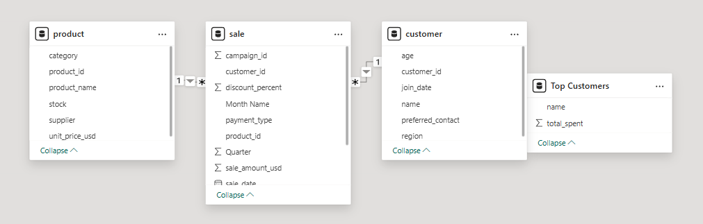


# Move to Power BI and analyze data
Here, we move to analyzing our data using SQL through PowerBI. In this example, we sum total sales per person to determine the top customers.

```shell
let
    Source = Odbc.Query("dsn=SmartSalesDSN", 
        "
        SELECT c.name, SUM(s.sale_amount_usd) AS total_spent 
        FROM sale s 
        JOIN customer c ON s.customer_id = c.customer_id 
        GROUP BY c.name 
        ORDER BY total_spent DESC
        "
    )
in
    Source
```

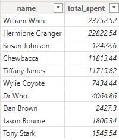

# Utilize Power BI to Create Visualizations

First, a bar chart of our top customers
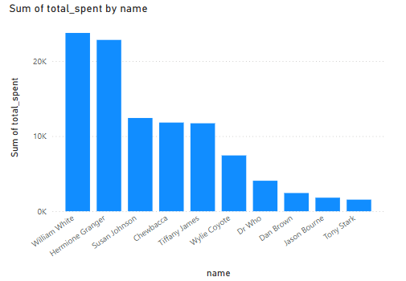

Second, a line chart of sales per quarter, which can be sliced by category
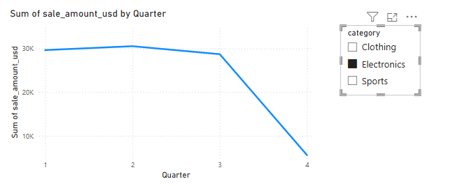


###  Part 2 - Business OLAP

Now, we will look into the question posed above, on whether this store could utilize seasonal help. We will also see if factoring in product type allows for any further conclusions.

# Section 1 - The Business Goal

Analyze quarterly sales to determine if a seasonal changes in employment may benefit the business.

# Section 2 - Data Source

Data started as raw, which was then prepared as listed above. It was pushed into Microsoft PowerBI and can was also edited within Python.

# Section 3 - Tools

We will use Python to clean data and do some OLAP analysis, as well as Microsoft BI for some quarying and visualization.

# Section 4 - Data Workflow & Logic

We focus on total sales amount and total transactions, categorized by product, by quarter.

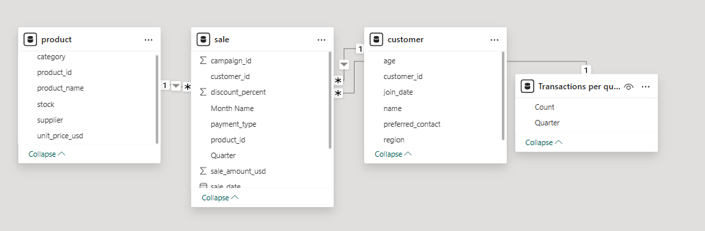

# Section 5 - Results

As we begin analyzing the data, it's first important to look at how much data we are working with. For this, we can use PowerBI to create a unique query that calculates the ammount of transactions per quarter, like this:

```
let
    Source = Odbc.DataSource("dsn=Smart_Store_DB", [HierarchicalNavigation=true]),
    sale_Table = Source{[Name="sale",Kind="Table"]}[Data],
    #"Inserted Year" = Table.AddColumn(sale_Table, "Year", each Date.Year([sale_date]), Int64.Type),
    #"Inserted Quarter" = Table.AddColumn(#"Inserted Year", "Quarter", each Date.QuarterOfYear([sale_date]), Int64.Type),
    #"Inserted Month Name" = Table.AddColumn(#"Inserted Quarter", "Month Name", each Date.MonthName([sale_date]), type text),
    #"Grouped Rows" = Table.Group(#"Inserted Month Name", {"Quarter"}, {{"Count", each Table.RowCount(_), Int64.Type}})

in
    #"Grouped Rows"
```

This results in:

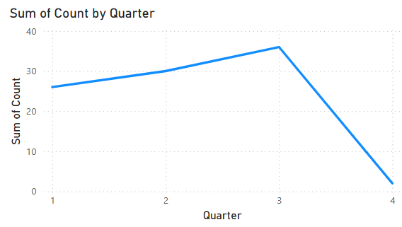

This is important for us to slice the data in this way, because it shows us that there isn't enough data for us to fairly judge Q4. When looking at the raw data, it stops in early October, which is barely into Q4. Because of this, we have to omit Q4 from our further analysis.

The next step is to analyze overall sales by quarter to see if we get any additional context. This can be done through python OLAP, using the programs below:

```shell

.\.venv\Scripts\activate
py scripts\OLAP\olap_cubing.py
py scripts\OLAP\olap_sales_by_quarter.py

```

Using this, we get the following:

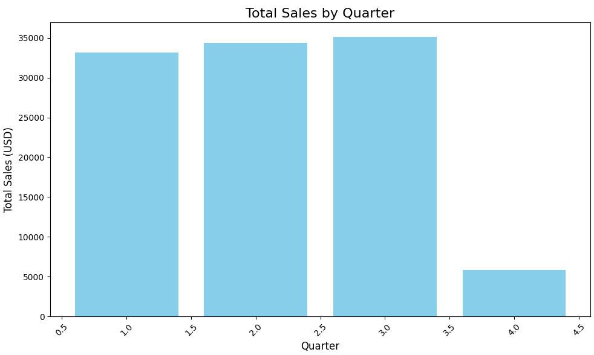

We can do the same analysis through PowerBI, seen below.

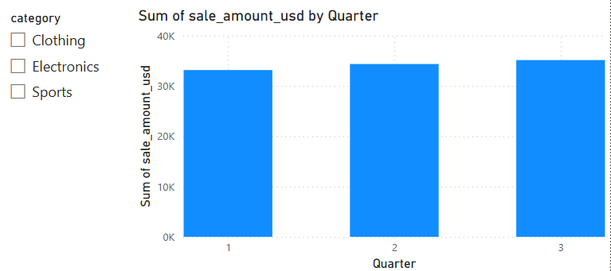

This also is split by catergory and so we can analyze the product category sales per quarter.

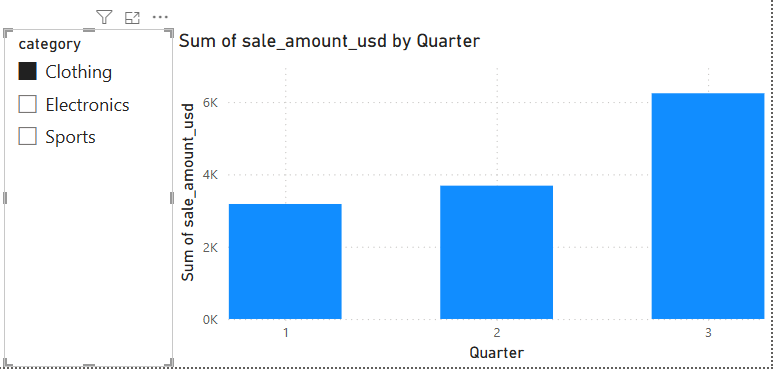


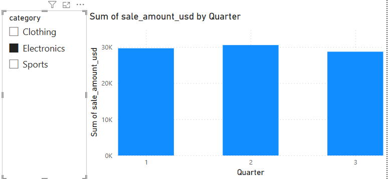


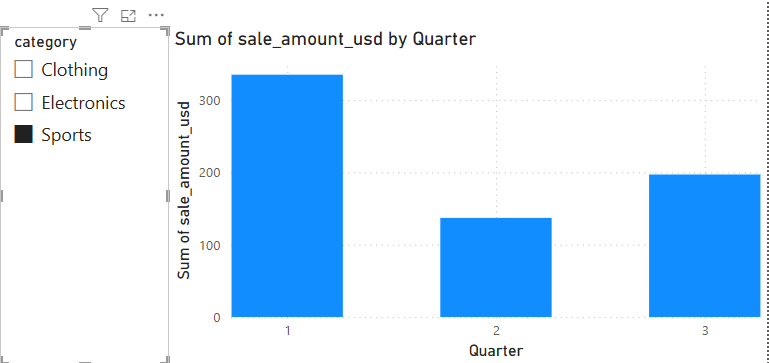

This can also be analyzed through a matrix:

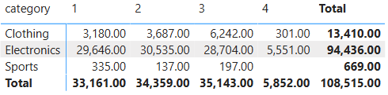

# Section 6 - Suggested Business Action

Looking at the results, we see there isn't a large discrepancy in the transactions per quarter, which already suggests there isn't a clear argument for more or less help during a specific season. The important caveat is we aren't working with a large amount of data, so it's difficult to draw concrete conclusions.

Where we do see a greater divide in quarterly behavior is among product types, where clothing has much more sales in Q3, and sporting has much more in Q1. While seasonal help isn't supported through this analysis, the store could benefit from supporting the sporting good sales in Q1 and clothes in Q3. That may mean pushing the products more, or having more supply in stock.

# Section 7 - Challenges

The main challenge of this analysis was the small amount of data we are using. It's difficult to draw conclusions of quarterly sales when there is less than 40 transactions per quarter in this data set. 